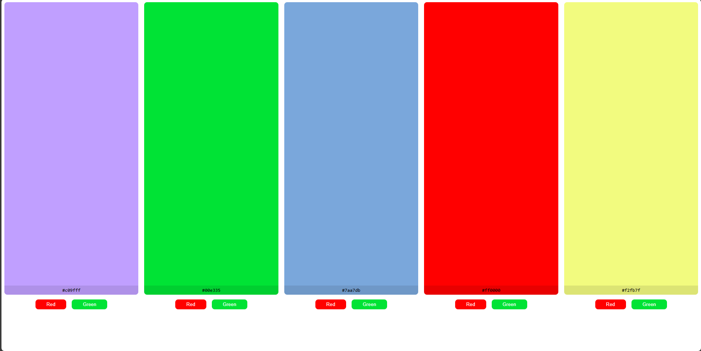

## ✨ Features

- Click on a box to generate a random background color.
- Display the hex color code inside the box.
- Use preset buttons to quickly apply red or green colors.
- Fully responsive design for mobile, tablet, and desktop screens.

## 📱 Responsive Layout

Using CSS Grid and media queries, the layout adjusts automatically:
- 1 column on mobile
- 2 columns on tablet
- 3–5 columns on desktop depending on screen width

## 🚀 How to Use

1. Clone or download the project.
2. Open the `index.html` file in your browser.
3. Click on any colored box to change its background to a random color.
4. Use the "Red" or "Green" buttons to apply preset colors.

## 🛠 Built With

- **HTML5**
- **CSS3** (with Grid and Media Queries)
- **Vanilla JavaScript** (no external libraries)

## 📸 Preview :

